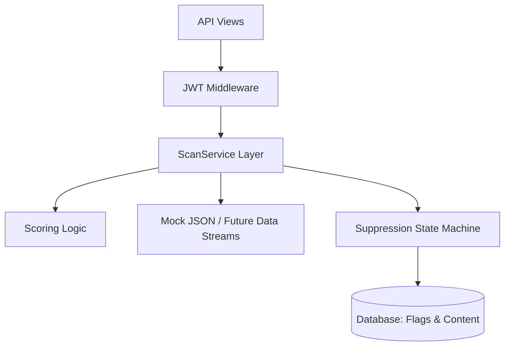

# FlagEngine 🚩
### Enterprise Content Monitoring & Flagging System

**FlagEngine** is a robust, RESTful API built with Django designed to automate content monitoring, relevance scoring, and human-in-the-loop review workflows. It serves as a backend engine for PR teams, brand sentiment analysis, and content moderation platforms.

By leveraging **Clean Architecture** principles (separating business algorithms from HTTP layers) and providing features like **Smart Suppression Logic**, FlagEngine ensures that reviewers only see high-confidence signal, eliminating redundant work caused by noisy data streams.

---

## 🚀 Key Technical Features

- **Intelligent Scoring Mechanism:** Evaluates matches conceptually (e.g., exact title matches yield a 100 confidence score, whereas buried body text yields 40).
- **Smart Suppression State Machine:** When a reviewer marks a flag "irrelevant," the engine suppresses it in future scans. However, if the source content is updated post-review, the flag reliably resurfaces. 
- **Production-Ready Security:** Fully secured via JSON Web Tokens (JWT) ensuring all endpoints strictly enforce authentication.
- **Scalable Infrastructure:** Implements structural pagination (20 items/page default) to prevent memory bottlenecks when querying vast datasets.
- **Pluggable Data Sources:** Engineered so that data ingestion (`ScanService`) is fully decoupled. Easily attach to NewsAPI, RSS feeds, or headless scrapers.
- **Robust Test Coverage:** 21 automated suite tests verifying scoring, suppression logic, and API behavior with simulated users.

---

## 🛠 Tech Stack

| Layer        | Technology                                     |
|--------------|------------------------------------------------|
| **Language** | Python 3.13                                    |
| **Framework**| Django 6.0.3 + Django REST Framework (DRF)     |
| **Auth**     | djangorestframework-simplejwt 5.3+             |
| **Database** | SQLite (Configured for local dev, Postgres ready)|

---

## ⚙️ Setup Instructions

### 1. Clone & Environment Setup
```bash
git clone https://github.com/yourusername/FlagEngine.git
cd FlagEngine

# Create and activate virtual environment
python -m venv venv
venv\Scripts\activate      # Windows
source venv/bin/activate   # Mac / Linux
```

### 2. Install Dependencies
```bash
pip install -r requirements.txt
```

### 3. Database Preparation
```bash
python manage.py migrate
# Create a superuser to access the API
python manage.py createsuperuser
```

### 4. Run the Server
```bash
python manage.py runserver
```
Server starts at → `http://127.0.0.1:8000`

---

## 🧪 Running Automations & Tests

To execute the test suite (which validates edge cases for the suppression logic):
```bash
python manage.py test monitor
```
*Outputs: `Ran 21 tests in ~0.05s - OK`*

---

## 📡 API Endpoints & Usage

Since the API is secured by JWT, you must obtain a token first.

### 1. Authenticate (Get Token)
```bash
curl -X POST http://127.0.0.1:8000/api/token/ \
  -H "Content-Type: application/json" \
  -d "{\"username\": \"your_username\", \"password\": \"your_password\"}"
```
*Save the `access` token returned to use in the headers below.*

### 2. Manage Keywords
```bash
# Add a Keyword
curl -X POST http://127.0.0.1:8000/api/keywords/ \
  -H "Authorization: Bearer <YOUR_ACCESS_TOKEN>" \
  -H "Content-Type: application/json" \
  -d "{\"name\": \"python\"}"

# List all Keywords (Paginated)
curl -H "Authorization: Bearer <YOUR_ACCESS_TOKEN>" http://127.0.0.1:8000/api/keywords/
```

### 3. Execute Core Scan
Running a scan pulls data from the local mock pipeline, scores matches, and applies suppression rules.
```bash
curl -X POST http://127.0.0.1:8000/api/scan/ \
  -H "Authorization: Bearer <YOUR_ACCESS_TOKEN>"
```

*Expected JSON Response:*
```json
{
  "message": "Scan completed successfully.",
  "results": {
    "keywords_scanned": 4,
    "articles_scanned": 6,
    "flags_created": 7,
    "flags_suppressed": 0
  }
}
```

### 4. Review Workflows (Flags)
Retrieve paginated flags, sorted dynamically by confidence score (Highest `score` first).
```bash
# Get all flags
curl -H "Authorization: Bearer <YOUR_ACCESS_TOKEN>" http://127.0.0.1:8000/api/flags/

# Filter by pending items
curl -H "Authorization: Bearer <YOUR_ACCESS_TOKEN>" http://127.0.0.1:8000/api/flags/?status=pending

# Reviewer Decision: Mark a Flag Irrelevant (Triggers Suppression)
curl -X PATCH http://127.0.0.1:8000/api/flags/1/ \
  -H "Authorization: Bearer <YOUR_ACCESS_TOKEN>" \
  -H "Content-Type: application/json" \
  -d "{\"status\": \"irrelevant\"}"
```

---

## 🏗 Architecture Details

All core business algorithms live inside `monitor/services.py`, enforcing a strict domain boundary.



By decoupling standard view handlers from the logic tree, `FlagEngine` is easily maintainable and can adopt new external REST APIs (for data sourcing) without requiring total foundational rewrites.